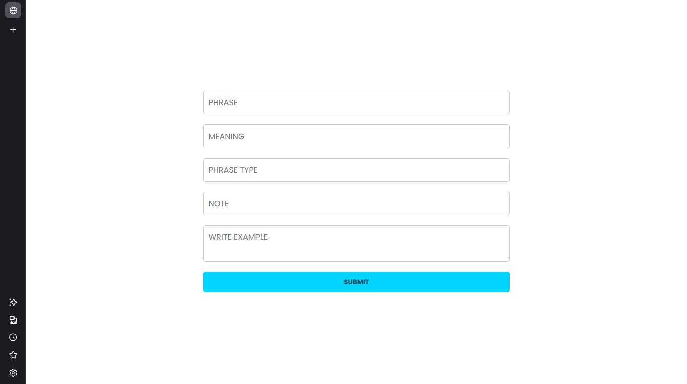

# WordForge: A Database of English Phrases & Idioms

Hey contributors! I’m working on WordForge, a simple database to store English phrases and idioms, including their meanings, types, and examples, all in a JSON file. I need your help to research and compile these expressions into a clean, useful collection. Join me to build this straightforward language resource!

